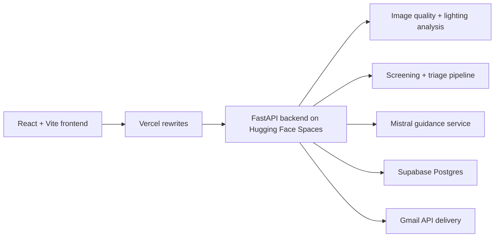
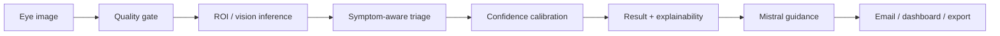

<div align="center">


# AnemiaLens

### Smartphone-first anemia screening with quality gating, calibrated risk scoring, and grounded clinical guidance

**No lab. No needle. No waiting.**

[](https://anemia-lens.vercel.app)
[](https://asnannp-anemialens.hf.space/health)
[](https://asnannp-anemialens.hf.space/docs)
[](https://react.dev)
[](https://fastapi.tiangolo.com)
[](https://supabase.com)
[](LICENSE)

</div>

---


---

## Overview

AnemiaLens turns a smartphone photo of the inner lower eyelid into a **first-pass anemia screening workflow**. It combines:

- conjunctival image analysis
- image quality and lighting checks
- symptom-aware triage
- calibrated confidence scoring
- grounded guidance generated with Mistral AI
- email-ready case sharing from the live app

The goal is not to replace laboratory testing. The goal is to help people reach the **right next step earlier**, especially where lab access is delayed, expensive, or unavailable.

> **Clinical safety posture:** AnemiaLens is a screening aid only and does not diagnose anemia or replace the advice of a qualified medical professional.

---

## Why It Matters

Anemia affects a massive global population, but screening often still depends on:

- lab access
- trained staff
- travel and cost
- turnaround time

AnemiaLens is built around a simpler question:

**Can a phone help flag when someone may need a blood test sooner?**

---

## Live Product

- **Frontend:** [https://anemia-lens.vercel.app](https://anemia-lens.vercel.app)
- **Backend health:** [https://asnannp-anemialens.hf.space/health](https://asnannp-anemialens.hf.space/health)
- **Backend docs:** [https://asnannp-anemialens.hf.space/docs](https://asnannp-anemialens.hf.space/docs)
- **Runtime status:** [https://asnannp-anemialens.hf.space/api/runtime-status](https://asnannp-anemialens.hf.space/api/runtime-status)

---

## What the App Does

### Screening workflow

1. Capture or upload an inner-eyelid image
2. Run quality checks before trusting the image
3. Add symptom context
4. Generate a risk band and triage score
5. Explain why the result happened
6. Show confidence and trust level separately
7. Recommend the safest next action
8. Save or share the case by email

### Trust layers built into the result

- **Image Quality Gate**
  - blur
  - framing
  - brightness
  - glare risk
  - shadow risk
  - lighting condition classification

- **Risk Explanation**
  - image-led signal summary
  - symptom contribution
  - capture quality impact
  - calibrated confidence framing

- **Safety Output**
  - retake prompts when image quality is weak
  - screening-not-diagnosis warning
  - clinician-follow-up language for moderate or concerning cases

### Product-level account features

- guest-first screening flow
- sign up / sign in with Supabase-backed auth
- save current screening into an account
- personal dashboard and saved history
- email delivery through Gmail API from the hosted app

---

## Architecture



### Inference pipeline



---

## Evaluation Snapshot

Current deployed ROI screening report:

| Metric | Value |
|---|---:|
| Accuracy | **88.64%** |
| Precision | **84.62%** |
| Recall | **78.57%** |
| F1 | **81.48%** |
| Validation size | `44` |
| Total evaluation records | `432` |

Calibration report:

| Diagnostic | Before | After |
|---|---:|---:|
| ECE | `0.2620` | **0.0909** |
| Brier score | `0.0906` | **0.0501** |

Source artifacts:

- [backend/models/deployed_screening_report.json](backend/models/deployed_screening_report.json)
- [backend/models/runtime_calibration_report.json](backend/models/runtime_calibration_report.json)

---

## Core Capabilities

| Area | What ships today |
|---|---|
| Vision screening | Eye-image screening with ROI-based risk inference |
| Quality intelligence | Blur, framing, brightness, glare, and shadow detection |
| Lighting understanding | Balanced, dim, overexposed, glare-heavy, shadow-heavy |
| Confidence design | Confidence separated from reliability / trust level |
| Guidance | Mistral-powered patient-facing clinical guidance |
| Accounts | Register, sign in, save current screening, view dashboard |
| Reporting | Email-friendly screening summary through Gmail API |
| Deployment | Vercel frontend + Hugging Face backend + Supabase database |
| SEO | Structured metadata, sitemap, robots, social sharing assets |

---

## Tech Stack

### Frontend

- React 18
- TypeScript
- Vite
- Framer Motion
- Three.js
- Radix UI primitives
- Vercel deployment

### Backend

- FastAPI
- SQLAlchemy
- PostgreSQL / Supabase
- PyTorch
- scikit-learn
- Mistral AI
- Gmail API
- JWT auth
- Hugging Face Spaces deployment

---

## Quick Start

### 1. Run the backend

```bash
cd backend
python -m venv .venv
.venv\Scripts\activate
pip install -r requirements.txt
python start_server.py
```

Backend health:

- [http://127.0.0.1:5000/health](http://127.0.0.1:5000/health)

### 2. Run the frontend

```bash
cd frontend
npm install
npm run dev
```

Frontend:

- [http://127.0.0.1:5173](http://127.0.0.1:5173)

---

## Environment

### Required backend environment variables

| Variable | Purpose |
|---|---|
| `DATABASE_URL` | Supabase Postgres pooler connection string |
| `JWT_SECRET_KEY` | access and refresh token signing |
| `JWT_ALGORITHM` | usually `HS256` |
| `ANEMIALENS_MISTRAL_API_KEY` | Mistral guidance generation |
| `ANEMIALENS_MISTRAL_MODEL` | current default: `mistral-small-latest` |
| `ANEMIALENS_EMAIL_PROVIDER` | `gmail_api` for the hosted setup |
| `ANEMIALENS_GMAIL_CLIENT_ID` | Google OAuth client |
| `ANEMIALENS_GMAIL_CLIENT_SECRET` | Google OAuth client secret |
| `ANEMIALENS_GMAIL_REFRESH_TOKEN` | refresh token with `gmail.send` scope |
| `ANEMIALENS_EMAIL_FROM_EMAIL` | verified Gmail sender |
| `ANEMIALENS_EMAIL_REPLY_TO` | reply-to address |

See:

- [backend/.env.example](backend/.env.example)

---

## Deployment

### Frontend

The frontend is deployed to Vercel and rewrites API traffic to Hugging Face:

- [vercel.json](vercel.json)

### Backend

The backend runs on Hugging Face Spaces and exposes:

- `/health`
- `/api/runtime-status`
- `/api/analyze`
- `/api/auth/*`
- `/api/history/*`
- `/api/email-report`

### Database

Supabase provides:

- user auth persistence
- saved screening history
- account dashboard data

Before first production use, apply:

- [backend/supabase_schema.sql](backend/supabase_schema.sql)

---

## Repository Layout

```text
AnemiaLens/
├─ backend/
│  ├─ app/
│  │  ├─ api/
│  │  ├─ ml/
│  │  ├─ services/
│  │  ├─ middleware/
│  │  ├─ config.py
│  │  ├─ database.py
│  │  └─ main.py
│  ├─ models/
│  ├─ tests/
│  ├─ supabase_schema.sql
│  └─ start_server.py
├─ frontend/
│  ├─ public/
│  ├─ src/
│  └─ tests/
├─ vercel.json
└─ README.md
```

---

## Product Notes

- The app is intentionally **guest-friendly first**, then account-aware.
- The result page is designed to keep the main story short:
  - result
  - why it happened
  - confidence / trust level
  - safest next step
  - share / save actions
- Weak captures do not get the same level of certainty as clean captures.
- Hemoglobin estimates are withheld when the system does not consider them trustworthy enough.
- A GitHub-ready social preview asset is included at [docs/assets/github-social-preview.svg](docs/assets/github-social-preview.svg) if you want to upload it in the repository social preview settings.

---

## Disclaimer

AnemiaLens is a screening aid only. It does not diagnose anemia, prescribe treatment, or replace clinical testing such as CBC or hemoglobin confirmation.

---

<div align="center">

**Because a phone should be able to help someone reach care earlier.**

[Live App](https://anemia-lens.vercel.app) · [API Docs](https://asnannp-anemialens.hf.space/docs) · [GitHub](https://github.com/Asnanp/AnemiaLens)

</div>
