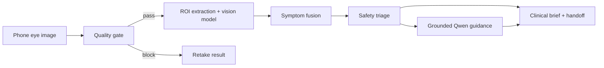

# AI Stack

## Overview

AnemiaLens uses two AI layers:

1. A vision screening layer that analyzes conjunctiva images.
2. A grounded GenAI layer that turns structured screening output into safe guidance.

## End-to-end flow

## Vision layer

- ROI extraction: conjunctiva-focused crop with fallback rescue path
- Image quality checks: blur, brightness, contrast, framing, visibility
- Prediction output:
  - anemia risk
  - estimated hemoglobin when stable enough to show
  - confidence
  - uncertainty
  - reliability flag

## GenAI layer

Current provider:

- `Qwen/Qwen2.5-7B-Instruct`
- Accessed through Hugging Face Inference Providers using the `together` provider route

Current GenAI responsibilities:

- plain-language explanation
- urgency guidance
- region-aware food advice
- ordered next steps

## Grounding design

The GenAI layer is intentionally constrained. It is only given:

- triage band and triage score
- screening text and label
- anemia risk
- predicted hemoglobin if stable enough to display
- confidence and uncertainty
- symptom inputs
- optional language and region

It is not allowed to invent:

- diagnosis
- certainty
- extra symptoms
- medications
- supplements
- unsupported causes
- lab values not already present in the payload

## Prompting strategy

The system prompt enforces:

- screening-only wording
- JSON-only output
- short bounded fields
- no diagnostic claims
- no unsupported medical advice

The parser then validates the output and rejects unsafe text.

## Safety fallback

AnemiaLens does not depend entirely on live GenAI.

Fallback behavior activates when:

- Qwen is disabled
- no Hugging Face token is configured
- the provider request fails
- the screening result is too uncertain
- the case is already a retake-needed result

The fallback path still returns:

- explanation
- urgency guidance
- food advice
- next steps

This means the product remains usable in demo and real-world low-connectivity conditions.

## Why GenAI is essential here

The GenAI layer is not decorative chat. It solves a real translation problem:

- raw screening scores are hard for users to act on,
- healthcare wording must stay cautious,
- advice must adapt to region and symptom context,
- and the output must remain concise enough for mobile use.

GenAI turns structured model output into a safer, more human, more actionable interface.
